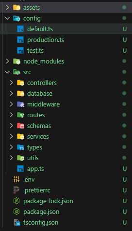

# Installation

`npm i -g create-node-express-ts`

# Projects structure

Now we implement only one project structure as in the image below<br/>


## folders

### assets

this where you should put all assets files of your project

### src

It's he source code folder, where to store all of your typescript files

#### controllers

This folder shoud be used to store all of your express functions controllers like

```
export const readAllAppHandler = async (req: Request, res: Response) => {
  try {
    const apps = await appService.readAll();
    res.json(apps);
  } catch (error: any) {
    errHandler(error, res, "error reading all apps");
  }
};

```
#### database
It's where you should store your models and mock data
you can evenly add another file for exporting functions related to manage connection to your database. This folder is seperate into 2 sub-folders : 
- mock
- models

#### middlewares
here's where you should save your middleware functions

#### routes
Define all of your api routes and endPoints

#### schemas
Save Schemas for zod validation or any validation library you want

#### services
Here you have to save all your services

#### typescript
Store your <span style="color:green;">types</span>, <span style="color:green;">interfaces</span> etc...

#### utils
Here you can store all functions that you think they're very usefull, like a errorHandler maybe. Just an example : 

```
import { Response } from "express";

function errHandler(error: any, res: Response, message: string) {
  console.log("error", error);
  return res.status(400).json({
    message,
    error: error.message,
  });
}

export default errHandler;
```

# Usage

Open a terminal, then install the package globally using this command : `npm i -g create-node-express-ts`
Then navigate to the parent folder of the folder you want populate.
Then run the command `create-node-server-ts [projectFolder]`
It will take a couple of minutes it depend on your network speed, but be patient.
after that you have to navigate to the project folder and just run `npm run dev`
then open your favorite browser and navigate to http://localhost:9000

It's ok your express using server is already created. and configured

